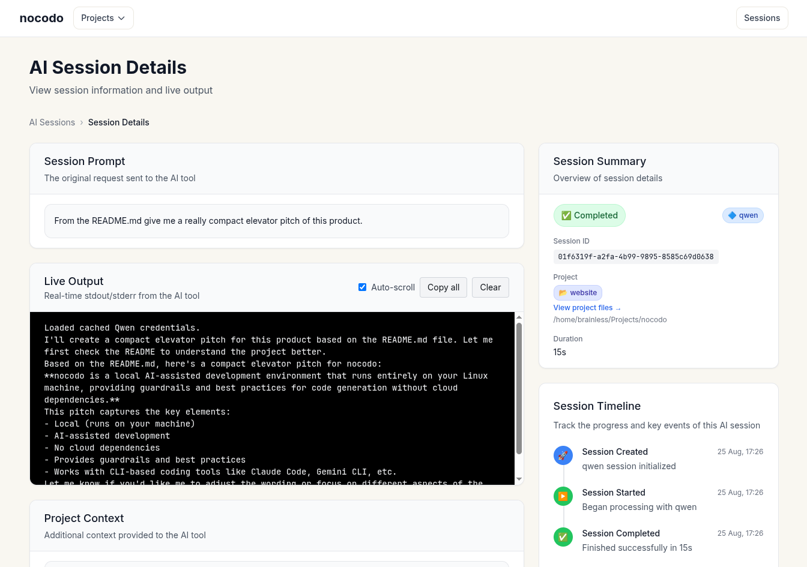

# nocodo 🤖

**Empowering teams worldwide to build and maintain business software without programming knowledge**

🚀 [**nocodo.com →**](https://nocodo.com)

> ⚠️ **Under Active Development** - This product is actively being developed. Please ⭐ star and 👀 watch this repository for updates!

Hello! I am Sumit, a software engineer living in a small Himalayan village in India. I am building nocodo to help teams around the world create custom business software without technical knowledge.

## 🌟 What is nocodo?

nocodo is your team's AI-powered development environment that runs securely on your own cloud server. It transforms ideas into working software while handling all the complex technical details behind the scenes.

### 🎯 **For Teams Who Want to Build Software**

Whether you're a marketing team wanting to customize your WordPress site, a startup building an e-commerce platform, or any team with software needs - nocodo empowers everyone to contribute to building their business software.

### 🔒 **Complete Privacy & Security**

- **Your server, your data**: Everything runs on your own cloud infrastructure
- **No vendor access**: The nocodo team never accesses your projects or code
- **Bring your own AI**: Use any AI models with your own API keys
- **No lock-in**: Switch cloud providers or AI models anytime

## ✨ How nocodo Helps Your Team

### 🤝 **Team Collaboration Made Simple**

- **Non-technical users welcome**: Marketing, design, and business teams can contribute ideas and request changes
- **Real-time collaboration**: Work together through a web-based interface accessible from any device
- **Task management**: Built-in project and issue tracking keeps everyone aligned
- **Secure access**: Use our simple app to connect to the development server over SSH for secure access. Test deployments are hosted on the development server and accessible through SSH with HTTP forwarding

### 🚀 **From Idea to Working Software**

- **Natural communication**: Describe what you want in plain language
- **Instant test deployments**: See your changes running immediately on separate test environments
- **Any tech stack**: WordPress, e-commerce platforms, custom applications - nocodo adapts to your needs
- **Autonomous operation**: Once configured, nocodo understands your project and works independently

### 🛡️ **Software Best Practices, Automatically**

nocodo handles the technical complexity so you don't have to:

- **Version control**: Automatic git branch creation and management for every task
- **Quality assurance**: Automated testing and code quality checks
- **Safe development**: Test new features without affecting your live software
- **Database management**: Handles database, cache, and web server setup for testing
- **CI/CD workflows**: Runs existing automation and creates new quality checks

## 🎯 Real-World Examples

### **Marketing Team Scenario**
Your marketing team uses WordPress for your company website. With nocodo, they can:
- Customize layouts and features without IT department involvement
- Test changes on separate deployments before going live
- Collaborate with developers when needed through the built-in chat

### **E-commerce Business**
Building an online store using PHP, Node.js, or Python:
- Add new features and customize workflows through natural language requests
- Test payment integrations and checkout flows safely
- Scale and modify your platform as your business grows

### **Startup Development**
Creating custom business software:
- Non-technical founders can contribute feature ideas and requirements
- Developers can focus on complex logic while nocodo handles routine tasks
- Rapid iteration and testing of new concepts

## 🏗️ How It Works

### **1. Setup & Understanding**
- Deploy nocodo on your cloud server
- nocodo scans your project to understand the technology stack
- If help is needed, bring engineers into the chat to guide nocodo

### **2. Collaborative Development**
- Team members request features or changes through the web interface
- nocodo creates separate git branches and test deployments automatically
- Review and test changes before merging to production

### **3. Continuous Improvement**
- GitHub integration for issue tracking and automation
- Continuous integration pipelines run automatically
- Quality checks and testing happen behind the scenes

## 🛠️ Technical Foundation

### **Secure Architecture**
- Runs entirely on your own infrastructure
- No data leaves your environment
- SSH-based secure access with HTTP forwarding for test deployments
- Web-based interface accessible from any operating system

### **Flexible Integration**
- **Git & GitHub**: Seamless version control and issue management
- **Multiple AI models**: Use your preferred AI providers with your own keys
- **Any tech stack**: Adapts to existing projects and technologies
- **Team scaling**: Invite unlimited team members

### **Development Environment**
- **Test deployments**: Separate environments for testing new features
- **Database management**: Automatic setup and management of development databases
- **Automated testing**: Runs existing test suites and creates new quality checks
- **Workflow automation**: CI/CD pipelines and quality assurance tools

## 🚀 Getting Started

Ready to empower your team with AI-assisted development?

1. **Deploy**: Set up nocodo on your cloud infrastructure
2. **Connect**: Integrate with your existing projects and tools
3. **Collaborate**: Invite your team and start building together
4. **Iterate**: Make unlimited changes and improvements with confidence

**[📚 Read the Complete Setup Guide →](https://nocodo.com/playbook)**

## 🌍 Join the Global Community

Teams worldwide are using nocodo to build:
- Custom business applications
- E-commerce platforms
- Marketing websites
- Internal tools and dashboards
- API integrations and automations

**Technical details and specifications**: See `specs/PROJECT.md` and linked documentation

---

**⚡ Ready to transform how your team builds software?** [**Get Started →**](https://nocodo.com)

> 🤖 Built with AI • 🔓 No lock-in • 🌍 Empowering teams worldwide
