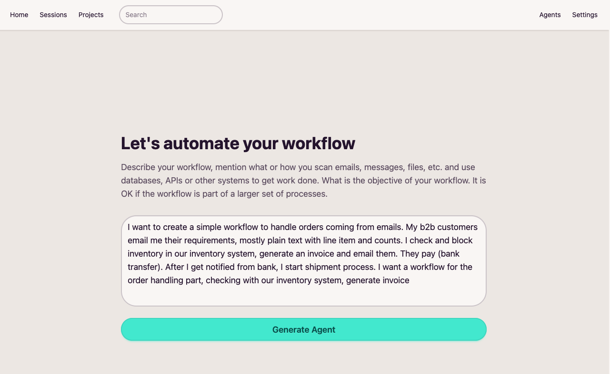
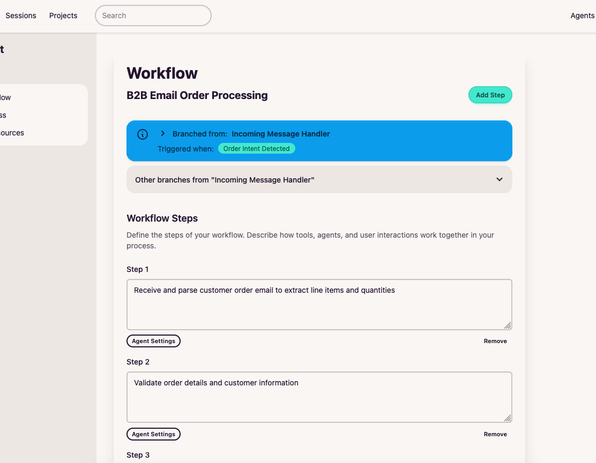
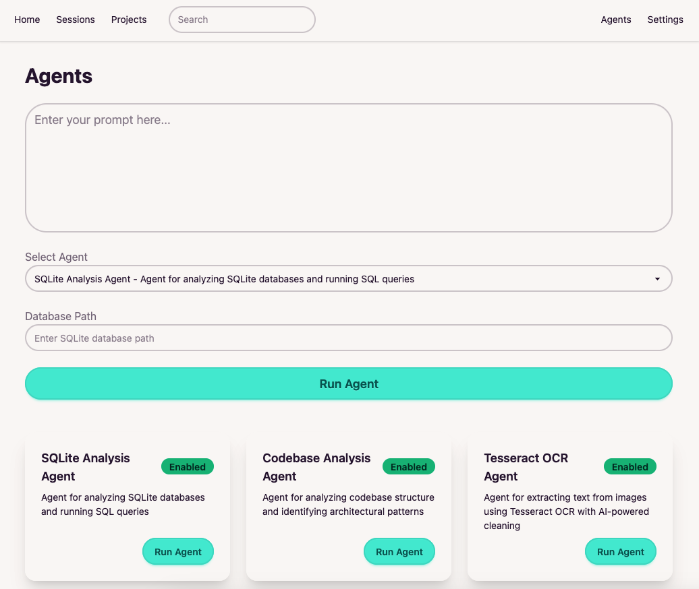
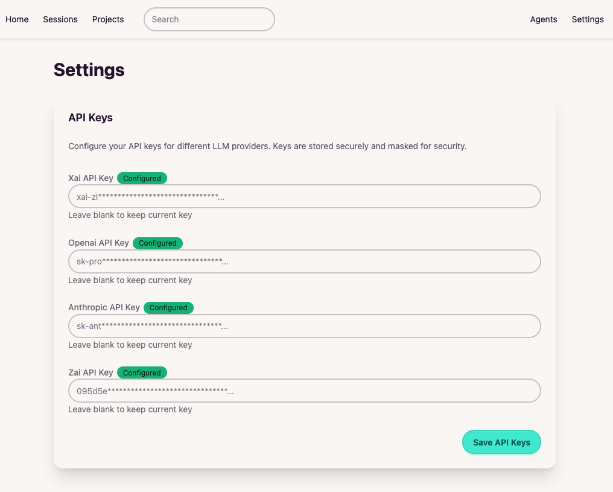

# nocodo

**Describe and automate your business processes with AI agents**

[**nocodo.com**](https://nocodo.com)

> Under active development - star and watch this repository to follow progress.

## What is nocodo?

nocodo helps you describe and automate business processes using AI agents. Instead of writing code or building complex integrations, you define what your workflow should accomplish, and nocodo's agents work together to get it done.

### How It Works

1. **Describe your business process** - Break down a high-level goal into a Workflow with clear steps
2. **Agents handle each step** - Each step is assigned to a specialized agent with the right tools for the job
3. **Results flow through the workflow** - Agents read data, extract information, compile answers, and respond

### The Multi-Agent Approach

nocodo uses a multi-agent pattern where each agent is focused on a simple, specific objective and equipped with the tools it needs. This keeps agents reliable and their outputs predictable, while allowing complex workflows to emerge from combining simple steps.

## Current Capabilities

### Data Analysis Agents
- **Database Analysis** - Query and analyze SQLite databases to understand schema and extract insights
- **Codebase Analysis** - Explore code repositories to understand structure, patterns, and dependencies
- **File & Folder Analysis** - Navigate and analyze local file systems

### Document Processing Agents
- **PDF to Text** - Extract and process text content from PDF documents
- **Excel to Text** - Read and convert spreadsheet data for analysis

### Model Support

nocodo supports multiple AI providers through a unified interface:
- **Anthropic** - Claude models (Opus, Sonnet, Haiku)
- **OpenAI** - GPT-4o, GPT-4, GPT-3.5
- **xAI** - Grok models
- **Cerebras** - Llama and GLM models

Choose the model that fits your needs for cost, speed, or capability.

## Coming Soon

### Messaging Integrations
- **WhatsApp** - Receive and respond to messages
- **Telegram** - Bot integrations for team and customer communication
- **Email** - Monitor inboxes and send responses
- **Slack** - Connect to workspace channels

These integrations will allow nocodo to listen for incoming messages, which become the starting point for your agent workflows. Imagine: a customer sends an email, an agent reads it, pulls relevant data from your database, compiles an answer, and sends a response - all automatically.

### More Agents
- API integrations for external data sources
- Web scraping and monitoring
- Report generation and document creation

## Use Cases

### Internal Teams
- Automate repetitive data gathering and analysis
- Generate reports from multiple sources
- Process and route internal requests
- Monitor systems and alert on issues

### Customer Support & External Operations
- Triage and respond to incoming messages
- Extract information from customer documents
- Look up data and compile answers
- Route complex issues to the right team

## Getting Started

nocodo is self-hosted, giving you full control over your data and processes.

1. Deploy nocodo on your infrastructure
2. Configure your AI provider API keys
3. Use the GUI to create workflows and assign agents
4. Let agents handle the work

## Project Structure

- `nocodo-agents` - Agent definitions and execution logic
- `nocodo-llm-sdk` - Unified interface for multiple AI providers
- `manager-tools` - Tools that agents use (file operations, database queries, etc.)
- `gui` - Web interface for creating and managing workflows

---

Built by Sumit, a software engineer in a small Himalayan village in India.

[**Get Started**](https://nocodo.com)
