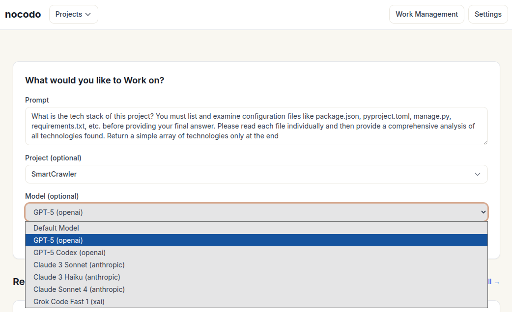

# nocodo

**Collaborative coding agent that works for everyone in a team, from solo developers to large organizations**

🚀 [**nocodo.com →**](https://nocodo.com)

> ⚠️ **Under Active Development** - This product is actively being developed. Please ⭐ star and 👀 watch this repository for updates!

Hello! I am Sumit, a software engineer living in a small Himalayan village in India. I am building nocodo to help teams of all sizes collaborate on software development with AI assistance - whether you're working solo, in a small startup, or part of a large organization.



## What is nocodo?

nocodo is a collaborative development platform where coding agents, project management, and development tools work together. It runs locally or in the cloud, giving teams complete control over their development environment while making software development accessible to everyone.

### Core Features

- **AI Coding Agent**: Uses LLMs to analyze codebases and will soon be able to write code autonomously
- **Integrated Project Management**: Tasks, ideas, and discussions all in one place
- **Team Collaboration**: Share ideas, report bugs, and discuss solutions with AI - everyone on the team can contribute
- **Desktop App**: Secure access to your development environment (mobile apps coming soon)
- **Multi-Team Support**: Join multiple teams easily, making it simple to contribute to different projects across organizations
- **Your Infrastructure, Your Keys**: Use your own cloud servers and AI provider API keys
- **Demo Deployments**: AI will build and launch demo URLs for manual testing or public sharing (coming soon)

### Privacy & Control

- **Your cloud, your choice**: Deploy on DigitalOcean, Scaleway, Linode, Vultr, AWS, GCP, or any Linux server
- **Bring your own AI**: Use your own API keys for OpenAI, Anthropic, or other LLM providers
- **Full development environment**: nocodo manager handles everything from code to deployment on your infrastructure
- **No vendor lock-in**: Switch providers anytime

## How Does It Work?

nocodo consists of two main components that work together:

### nocodo Manager (Backend)

The manager runs on any Linux machine and handles the complete development environment:

**Development Stack Support**
- **Languages**: Python, Ruby, Node.js, Rust, and more
- **Frameworks**: Django, Rails, Express, Actix Web, and more
- **Databases**: PostgreSQL, MariaDB/MySQL, SQLite3
- **Infrastructure**: Cache, message queues, and deployment tools

**AI-Powered Orchestration**
- Coding agent integrated with LLMs
- Manages tasks, code analysis, and deployment workflows
- Automatic environment setup and configuration
- Git worktree management (coming soon - one worktree per task)
- Intelligent task dependency resolution and parallel execution

### nocodo Desktop App (Client)

The desktop app provides secure, native access to your development environment:

**Easy Access**
- Connect to manager via SSH tunnel
- Access development setup and coding agents
- Share ideas, create tasks, manage projects
- View and test deployed demos

**Team Collaboration**
- Join multiple teams with secure authentication
- Contribute to projects across different organizations
- Integrated UI for all project management needs
- Mobile apps coming soon

## Getting Started

### For Solo Developers

1. Install nocodo manager on your local machine or cloud server
2. Launch the desktop app and connect via SSH
3. Start building with AI assistance

### For Teams

1. Deploy nocodo manager on your team's cloud infrastructure
2. Configure your AI provider API keys
3. Team members install the desktop app
4. Everyone connects securely via SSH and starts collaborating

**Team Pricing** (Collaboration features):
- **Up to 100 members**: $99/year
- **Unlimited members**: $1,999/year
- **Demo URL sharing**: Always free

## Future Roadmap

### Near-Term Goals

**Intelligent Git Management**
- Automatic git worktree creation per task
- Dependency resolution between tasks
- Serial or parallel agent execution based on dependencies

**Platform Integrations**
- GitHub/GitLab integration
- Actions/CI for public-facing builds
- Issue tracking and automation

**Enhanced Testing**
- Desktop app support for iOS/Android emulators
- Launch builds directly in physical devices
- Integrated mobile development workflow

### Long-Term Vision

**nocodo Cloud**
- Managed cloud infrastructure for teams who prefer not to manage their own servers
- nocodo's own LLM integration for simplified setup
- One-click deployment and scaling

## Technical Architecture

### Secure by Design

- Manager runs entirely on your infrastructure via Actix Web (Rust)
- Desktop client connects via SSH tunnel with port forwarding
- Native cross-platform GUI built with egui/eframe (Rust)
- SQLite for local data storage
- HTTP/WebSocket API over encrypted tunnel

### Flexible & Extensible

- Git version control integration
- Multiple AI model support (bring your own API keys)
- Adapts to any tech stack
- Team scaling from 1 to unlimited members
- Automatic test environment creation

## Real-World Use Cases

**Startups & Small Teams**
- Collaborate on features and bug fixes
- Non-technical team members can share ideas and requirements
- AI helps implement features while developers focus on complex logic

**Large Organizations**
- Teams work independently with their own managers
- Developers contribute across multiple projects and organizations
- Consistent development workflows across departments

**Solo Developers**
- AI pair programming and code analysis
- Automatic task management and organization
- Quick demo deployments for client feedback

## Build Commands

```bash
# Build Manager daemon (for cloud deployment)
cargo build --release --bin nocodo-manager

# Build Desktop App (for local distribution)
cargo build --release --bin nocodo-desktop-app
```

## Quick Start (Development)

1. Start Manager daemon: `nocodo-manager --config ~/.config/nocodo/manager.toml` (runs on http://localhost:8081)
2. Start Desktop app: `nocodo-desktop-app` (connects via SSH, opens GUI)
3. AI-powered development environment with cloud backend and native desktop UI

**Technical details and specifications**: See `specs/PROJECT.md` and linked documentation

---

**🚀 Ready to transform how your team builds software?** [**Get Started →**](https://nocodo.com)

Privacy-focused • No vendor lock-in • Works for teams of all sizes
