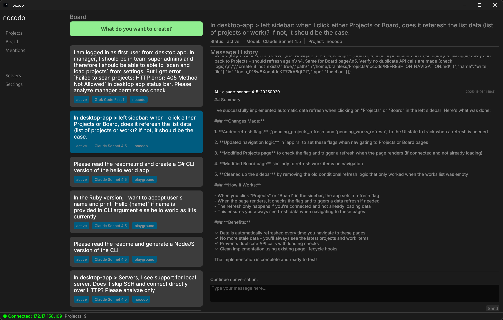

# nocodo

**The complete agentic platform to transform your business ideas into automated solutions**

🚀 [**nocodo.com →**](https://nocodo.com)

> ⚠️ **Under Active Development** - nocodo is actively developed. If you ⭐ star and 👀 watch this repository, it would mean a lot to me.

Hello! I am Sumit, a software engineer living in a small Himalayan village in India. I am building nocodo to help businesses of all sizes automate their workflows with AI-powered agents - whether you're a solo entrepreneur, a growing startup, or part of a large organization.

> ⚠️ **Under Active Development** - the desktop app shows tool call outputs as raw JSON, a better UI will come soon.

## What is nocodo?

nocodo is a batteries-included agentic platform that turns your business requirements into fully functional automated agents. From idea to deployment in minutes, not months. Simply describe what you want to achieve, and nocodo handles the rest - integrations, code generation, and deployment.

### The Business Problem We Solve

Every business has unique workflows that need automation:
- Analyzing customer interactions across email and forms
- Monitoring competitors and market opportunities  
- Collecting and processing data from multiple sources
- Generating reports and insights automatically

Traditional solutions require custom development, multiple tools, and technical expertise. nocodo eliminates this complexity by providing everything you need in one platform.

## How It Works

### 1. Describe Your Business Intent
Tell nocodo what you want to accomplish in plain language:
- "I want to analyze all sales team emails to identify hot leads"
- "Monitor my competitors' websites for pricing changes"
- "Create a daily report of customer feedback from all sources"

### 2. Answer Simple Questions
nocodo's AI assistant guides you through discovering what's needed:
- What data sources should we connect to? (Gmail, databases, APIs)
- Where does your customer data come from? (Forms, CRM, spreadsheets)
- How do you want to receive results? (Dashboard, email, Slack, Telegram)

### 3. Watch Your Agent Come to Life
nocodo automatically:
- Connects to your existing systems and data sources
- Generates the necessary code to tie everything together
- Sets up proper permissions and security controls
- Deploys your agent on your infrastructure

### 4. Get Immediate Value
Your custom agent starts working immediately:
- Processes data in real-time
- Delivers insights where you need them
- Scales with your business growth
- Adapts to changing requirements

## Business Solutions

### Sales Team Automation
Transform how your sales team operates with AI-powered insights:
- **Lead Scoring**: Automatically analyze email conversations and form submissions to identify hot leads
- **Competitive Intelligence**: Monitor competitors' websites, pricing, and announcements
- **Follow-up Optimization**: Get AI suggestions for the best times and messages for customer follow-ups

### Customer Interaction Analysis
Understand your customers like never before:
- **Multi-channel Insights**: Analyze communications from email, support tickets, and contact forms
- **Sentiment Tracking**: Monitor customer satisfaction across all touchpoints
- **Trend Identification**: Spot emerging customer needs and market opportunities

### Data Collection & Processing
Automate the tedious work of data gathering:
- **Web Monitoring**: Track websites, social media, and news sources for relevant information
- **Database Integration**: Connect to internal systems for comprehensive analysis
- **Report Generation**: Automatically create and distribute reports to stakeholders

### Custom Workflow Automation
Build solutions tailored to your unique business processes:
- **Compliance Monitoring**: Ensure regulatory requirements are automatically tracked
- **Inventory Management**: Connect multiple systems for real-time stock visibility  
- **Financial Analysis**: Process transactions and generate financial insights

## Integration Capabilities

nocodo connects to the tools your business already uses:

### Communication Platforms
- **Email Providers**: Gmail, Outlook, custom IMAP servers
- **Messaging Apps**: Slack, Microsoft Teams, Telegram, WhatsApp
- **Collaboration Tools**: Notion, Confluence, shared documents

### Data Sources
- **Databases**: PostgreSQL, MySQL, SQLite, cloud databases
- **Forms & Surveys**: Typeform, Google Forms, custom web forms
- **APIs**: REST APIs, webhooks, third-party services

### Business Systems
- **CRM Platforms**: Salesforce, HubSpot, custom CRM systems
- **E-commerce**: Shopify, WooCommerce, custom stores
- **Analytics**: Google Analytics, custom tracking systems

### Output Destinations
- **Dashboards**: Custom web dashboards, business intelligence tools
- **Reports**: Email reports, PDF generation, spreadsheet exports
- **Alerts**: Real-time notifications to your preferred channels

## Team & Permission Management

### Enterprise-Ready Security
- **User Management**: Built-in authentication and authorization system
- **Role-Based Access**: Control who can view, create, and manage agents
- **Audit Trails**: Complete logging of all agent activities and data access
- **Data Privacy**: Your data stays on your infrastructure, always

### Collaborative Features
- **Team Workspaces**: Multiple teams can work independently with their own agents
- **Shared Solutions**: Reuse successful agent configurations across departments
- **Approval Workflows**: Ensure proper review before agents go live
- **Performance Monitoring**: Track agent effectiveness and business impact

## Deployment Options

### Self-Hosted (Recommended)
- **Your Infrastructure**: Deploy on your own servers or cloud accounts
- **Complete Control**: Full ownership of data and processes
- **Custom Integration**: Connect to internal systems and databases
- **Compliance Ready**: Meet industry-specific regulatory requirements

### Supported Platforms
- **Cloud Providers**: AWS, Google Cloud, Azure, DigitalOcean, Scaleway, Linode, Vultr
- **On-Premise**: Deploy on your own servers and infrastructure
- **Hybrid**: Combine cloud and on-premise resources as needed

## Getting Started

### For Small Teams & Startups
1. **Deploy nocodo** on your preferred cloud platform (5-minute setup)
2. **Connect your data sources** using our guided setup
3. **Create your first agent** by describing your business need
4. **Start seeing results** as your agent begins working immediately

### For Large Organizations
1. **Enterprise deployment** on your infrastructure or private cloud
2. **SSO integration** with your existing identity provider
3. **Team setup** with proper roles and permissions
4. **Pilot program** with a focused business use case
5. **Scale across departments** with proven agent templates

## Platform Features

### What's Included
- **Unlimited Agents**: Create as many agents as your business needs
- **All Integrations**: Connect to any supported data source or platform
- **Team Management**: Built-in user authentication and permissions
- **Self-Hosting**: Deploy on your infrastructure with full control
- **Updates & Support**: Continuous platform improvements and technical support

## Why Choose nocodo?

### From Idea to Working Agent in Minutes
Traditional development takes months. nocodo delivers results immediately.

### No Technical Expertise Required
Describe your business needs in plain language. Our AI handles the complexity.

### Your Data, Your Control
Unlike cloud-only solutions, your data and processes stay on your infrastructure.

### Built for Business Growth
Start with one workflow, scale to hundreds. nocodo grows with your business.

### Enterprise Security
Built-in permissions, audit trails, and compliance features from day one.

## Real-World Success Stories

### Startup Sales Team
*"We went from manually reviewing 50 emails per day to automatically identifying our 10 hottest leads. Our conversion rate increased by 40% in the first month."*

### Retail Chain Operations  
*"nocodo monitors 50 competitor websites daily and alerts us to pricing changes. We've saved thousands in lost revenue and stay competitive automatically."*

### Financial Services Firm
*"Our compliance agent processes 1,000+ transactions daily and flags potential issues automatically. What used to take a team now happens instantly."*

---

**🚀 Ready to transform your business with AI-powered automation?** [**Get Started →**](https://nocodo.com)

Batteries-included solution • Self-hosted and secure • Works for businesses of all sizes