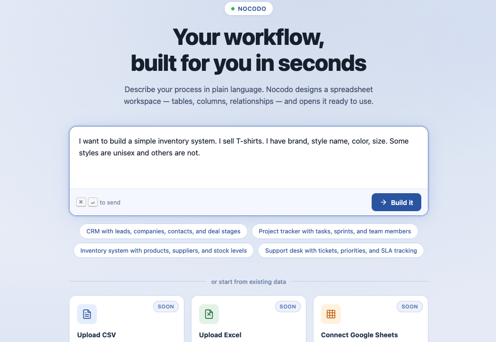
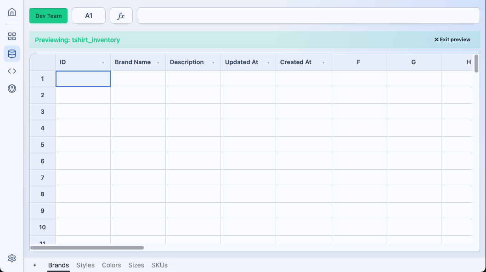
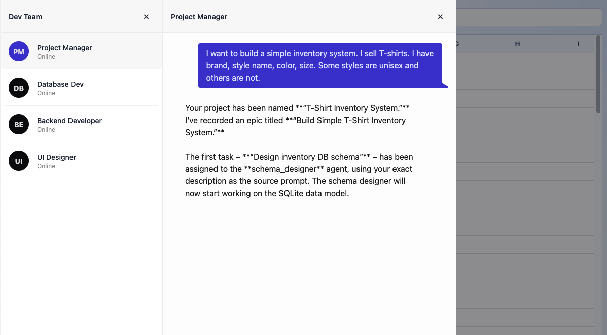
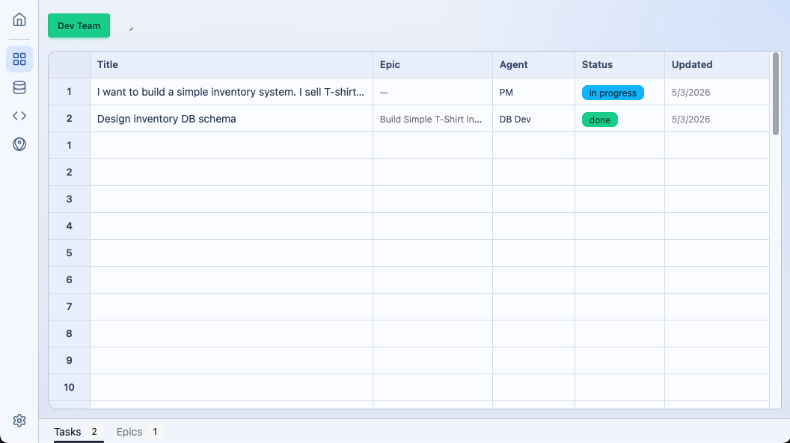

# nocodo

**Sheets Driven Development** — define your business workflow in a familiar spreadsheet UI, get a production-ready database and CRUD API automatically.

> Website: [nocodo.com](https://nocodo.com) &nbsp;·&nbsp; Docs & support: [nocodo.com](https://nocodo.com)

---

## What is nocodo?

nocodo lets you describe your application's data model and business logic the way you already think about it — in rows, columns, and sheets. From that definition, AI generates a real relational database schema and a full CRUD API. No boilerplate. No ORM config. No migrations written by hand.

It's a desktop app you run locally. Everything stays on your machine. When you're ready, self-host the generated backend or use nocodo's pay-as-you-go hosting with a custom domain.

---

## Features

### Spreadsheet UI for defining business workflows
Work in a spreadsheet-style interface to define entities, relationships, field types, and constraints. If you can model something in a sheet, nocodo can turn it into a running application.

### AI-generated database and CRUD API
nocodo uses an AI schema designer agent to translate your sheet definitions into a production-quality relational database schema and CRUD API. Currently targets **SQLite3**, with more backends planned.

- Automatic schema migrations
- Type-safe API backed by shared Rust types
- Chat with the AI assistant inside the app to refine your schema

### Project management with tasks and epics

Manage your work inside nocodo with built-in project tracking. Organise tasks under epics, assign them, and let the AI project manager keep everything in sync.

### Custom business logic with Rust/Wasm *(coming soon)*
Write custom business logic once, compile to WebAssembly, and share it across deployments. Runs anywhere nocodo runs.

### Multi-user auth and permissions *(coming soon)*
- Authentication and authorization built in
- Entity owner permissions
- Role-based access control (RBAC)

### Generated web app *(coming soon)*
nocodo will generate a web frontend for your application using **TypeScript, SolidJS, TailwindCSS, and DaisyUI** — ready to deploy alongside your API.

---

## Completely open source desktop app

nocodo is a Tauri desktop application wrapping the admin UI. The spreadsheet UI, AI agent, and generated schema are all yours — no lock-in.

- Run the desktop app locally on Mac, Windows, or Linux
- Share business logic as portable Wasm modules
- Inspect or modify every artifact nocodo produces

---

## Deployment options

| Option | Description |
|---|---|
| **Self-host** | Deploy the generated backend and frontend to your own server. Scripts included. |
| **nocodo hosting** | Pay-as-you-go managed hosting at [nocodo.com](https://nocodo.com) with custom domain support. |

---

## Tech stack

- **Backend** — Rust + Actix Web
- **Desktop app** — Tauri wrapping the admin UI
- **Shared types** — Rust types with TypeScript generation (no handwritten API contracts)
- **Admin UI** — TypeScript + SolidJS + TailwindCSS + DaisyUI
- **AI agents** — LLM-backed schema designer with SQLite-persisted sessions
- **Database** — SQLite (default); PostgreSQL support available

---

## Getting started

See [DEVELOP.md](DEVELOP.md) for local development setup, running the backend and UI, and the deploy workflow.

---

## Status

nocodo is in active development. Core spreadsheet UI and AI schema generation are functional. Auth, Wasm business logic, and the generated web app frontend are on the roadmap.

Contributions, feedback, and issues welcome at [github.com/brainless/nocodo](https://github.com/brainless/nocodo).
